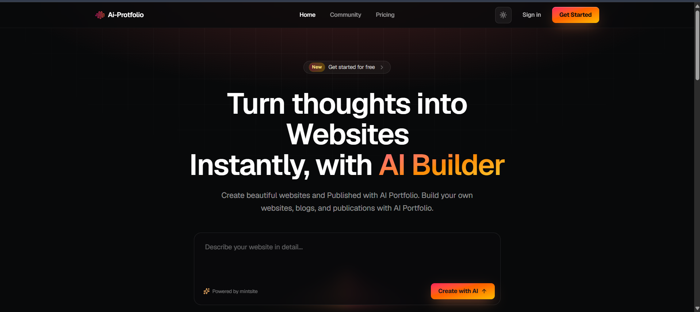
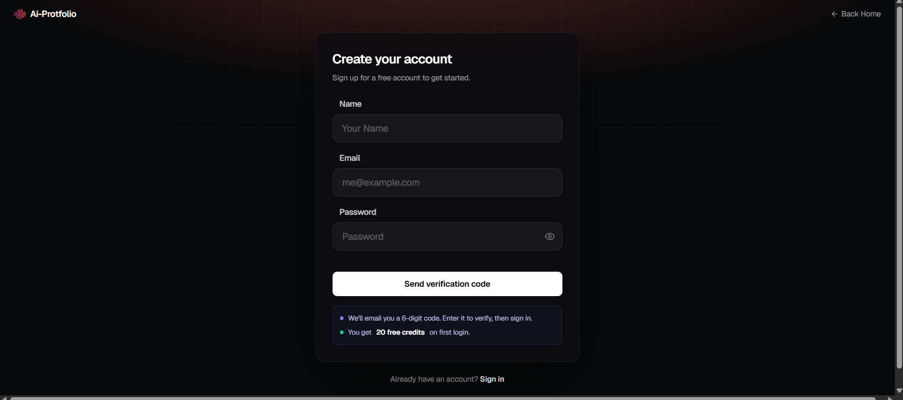
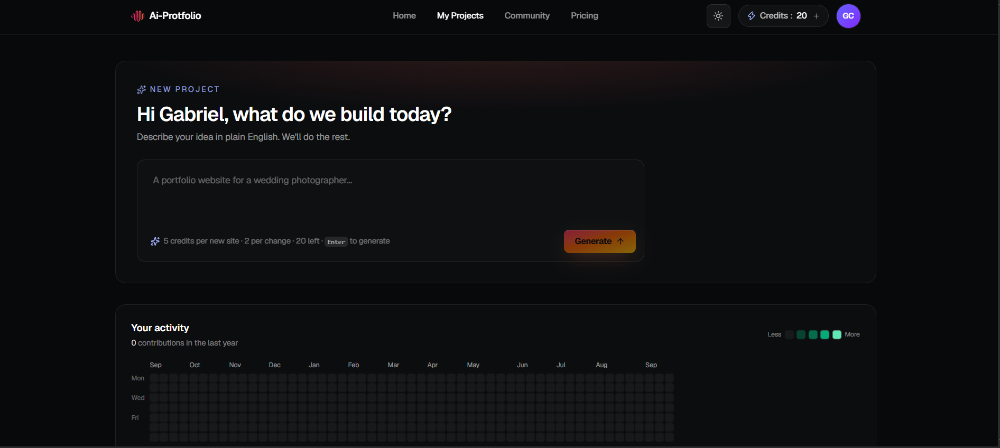
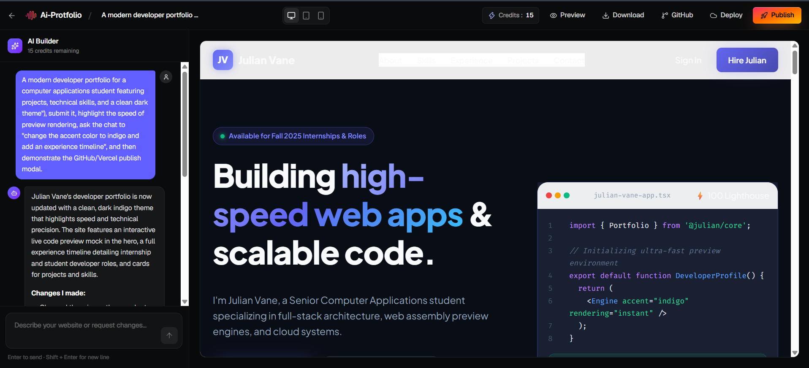
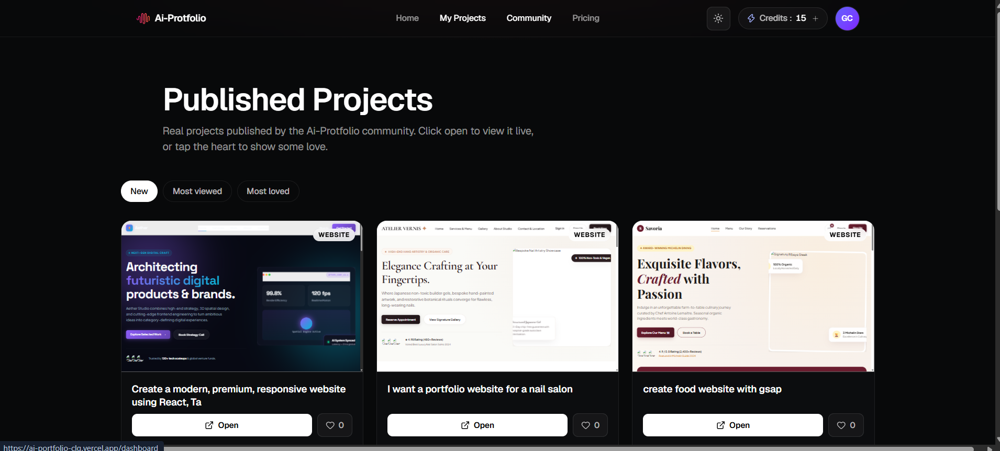
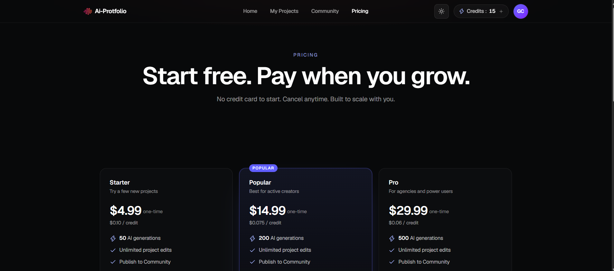

# AI Portfolio Builder

**Describe a website. Generate it with AI. Refine, preview, and share it from one workspace.**

AI Portfolio Builder is a full-stack application that turns natural-language prompts into website drafts. It combines a React workspace, a Node.js API, MongoDB persistence, and AI generation through Gemini and Groq. Creators can manage projects, request changes through chat, inspect responsive previews, download HTML, and publish their work.

**[Open the live demo](https://ai-portfolio-clg.vercel.app/)** · **[Source repository](https://github.com/jashanpreet-82099/Ai-Portfolio)** · **[Report an issue](https://github.com/jashanpreet-82099/Ai-Portfolio/issues)**

The interface uses the names **Ai-Protfolio** and **mintsite** in places; this README refers to the project as AI Portfolio Builder. Generated websites are HTML documents with styling and browser scripts, while the builder itself is a React application.



## Contents

- [Features](#features)
- [Project screenshots](#project-screenshots)
- [How it works](#how-it-works)
- [Technology stack](#technology-stack)
- [Architecture](#architecture)
- [Repository layout](#repository-layout)
- [Local development](#local-development)
- [Environment variables](#environment-variables)
- [Application routes](#application-routes)
- [API reference](#api-reference)
- [Data model](#data-model)
- [Credits and payments](#credits-and-payments)
- [Deployment](#deployment)
- [Development commands and verification](#development-commands-and-verification)
- [Troubleshooting and implementation notes](#troubleshooting-and-implementation-notes)
- [Contributing](#contributing)
- [License](#license)

## Features

| Area | Capabilities |
| --- | --- |
| AI website creation | Generate portfolio, business, blog, and other website drafts from a natural-language brief. Initial prompts are enhanced before generation. |
| Conversational editing | Request changes using the existing HTML and conversation history as context. |
| Responsive previews | Inspect generated pages in desktop, tablet, and mobile preview widths. |
| Project workspace | Create, rename, reopen, and delete saved projects; retain generated HTML and chat history. |
| Sharing and export | Download an HTML file, publish to the community, or use the GitHub and Vercel integration flows. |
| Community | Browse published sites, sort by newest, views, or likes, and like other creators' work. |
| Accounts | Email verification, JWT login, profile settings, and password-management screens and API routes. See [implementation notes](#troubleshooting-and-implementation-notes) for current gaps. |
| Credits | Start with 20 credits and purchase additional credit packs through Stripe Checkout. |
| Interface | Light and dark themes, generation feedback, toast notifications, and a dashboard activity heatmap. |
| Generation fallback | Use a starter template when AI is unavailable; preserve an existing site when an attempted update is unusable. |

## Project screenshots

These six supplied project captures show the main workflow. The landing-page capture appears above; the remaining views are below. Screenshots reflect the interface at capture time.

### Account registration

Create an account, request a six-digit verification code, and proceed to sign-in after verification.



### Dashboard and project creation

Start a new website from a prompt, check the available credit balance, and view the activity heatmap.



### AI builder and live preview

Refine a project through chat and inspect its generated page alongside responsive preview, download, GitHub, deployment, and publishing controls.



### Community gallery

Browse published projects and switch between newest, most viewed, and most loved listings.



### Pricing and credits

Explore the available one-time credit packs. The backend package definitions determine checkout amounts and credit allocations.



## How it works

1. **Register and verify.** Submit a name, email, and password, verify the six-digit code, then sign in. New user records receive 20 starting credits.
2. **Describe the site.** Create a project from the dashboard with a brief describing its purpose, content, sections, and preferred visual style.
3. **Generate a draft.** The API checks ownership and credits, enhances the initial brief, and requests an HTML document from the configured AI providers.
4. **Refine the result.** Send follow-up instructions in the builder. The API includes existing HTML and conversation context when generating an update.
5. **Preview and export.** Inspect different device widths or download the generated HTML.
6. **Share the project.** Publish it in the community, deploy its HTML to Vercel, or use the GitHub upload flow. These are separate actions.

Example initial prompt:

> Build a developer portfolio for a computer applications student. Include an introduction, technical skills, three project cards, an experience timeline, and a contact section. Use a dark theme with indigo accents and a responsive layout.

Example follow-up:

> Make the hero more compact, add GitHub links to the project cards, and change the accent color to teal.

The generation controller accepts prompts up to 2,000 characters. Generation is returned as a completed HTTP response; the app does not implement token streaming. Generated forms, carts, and sign-in interactions may be browser demonstrations and require their own service integrations for real application behavior.

## Technology stack

Versions below describe the major versions declared in the repository package manifests; lockfiles resolve exact installed dependencies.

| Layer | Technology | Role |
| --- | --- | --- |
| Web application | React 19, React Router 7 | Component UI, navigation, and protected routes |
| Build tooling | Vite 8, React Vite plugin | Development server and production frontend build |
| Styling | Tailwind CSS 4, Lucide React, React Icons | Layout, themes, and icons |
| Client communication | Axios, React Hot Toast | API requests and user feedback |
| API | Node.js, Express 5, CORS, dotenv | HTTP routes and environment configuration |
| Persistence | MongoDB, Mongoose 9 | Users, projects, messages, and payment records |
| Authentication | JSON Web Tokens, bcryptjs | Bearer-token authentication and password hashing |
| Generation | Gemini and Groq APIs | Prompt enhancement and HTML generation |
| Images | Unsplash integration and image fallbacks | Optional generated-site imagery |
| Email | Brevo transactional email API | Verification and password-reset codes |
| Payments | Stripe | Hosted checkout and server-side session verification |
| Publishing | Octokit/GitHub and Vercel APIs | Repository export and static-site deployment |
| Development | Nodemon, Oxlint | Backend watch mode and frontend linting |

## Architecture

The React client calls a single Express API. Authentication middleware resolves the current user, controllers apply project and credit rules, Mongoose persists records in MongoDB, and service helpers communicate with external providers.

The following Mermaid design is reproduced from the supplied architecture text, including its source-code links and color groups. It is a high-level map: theme state actually lives in `ThemeContext.jsx`, AI provider orchestration also uses `utils/llm.js`, and GitHub export is implemented alongside Vercel deployment. The diagram's "Safe HTML preview" label refers to the custom preview transformation helper, not a security certification.

```mermaid
flowchart TD

subgraph group_client["Web client"]
  node_app["App routes<br/>[App.jsx]"]
  node_authstate["Auth and theme state<br/>[AuthContext.jsx]"]
  node_dashboard["Dashboard<br/>[DashboardPage.jsx]"]
  node_builder["Website builder<br/>[BuilderPage.jsx]"]
  node_preview["Live preview<br/>[PreviewPage.jsx]"]
  node_previewguard["Safe HTML preview<br/>[safePreview.js]"]
  node_communityui["Community gallery<br/>[CommunityPage.jsx]"]
  node_pricingui["Pricing and credits<br/>[PricingPage.jsx]"]
  node_settingsui["Profile settings<br/>[SettingsPage.jsx]"]
  node_api["API client<br/>[api.js]"]
end

subgraph group_identity["Identity"]
  node_authroutes["Auth routes<br/>[auth.routes.js]"]
  node_authcontroller["Auth and account logic<br/>[auth.controller.js]"]
  node_authmiddleware["JWT auth guard<br/>[Auth.js]"]
  node_user["User records<br/>[User.js]"]
  node_emailotp["OTP and email services<br/>[services.js]"]
end

subgraph group_creation["Site creation"]
  node_projectroutes["Project routes<br/>[project.routes.js]"]
  node_projectcontroller["Project and generation logic"]
  node_projectmodel["Project records<br/>[Project.js]"]
  node_aiservices["AI generation services<br/>[services.js]"]
  node_mockgen["Fallback site generator<br/>[mockGenerator.js]"]
end

subgraph group_publishing["Publishing and community"]
  node_deployroutes["Deploy routes<br/>[project.deploy.js]"]
  node_communityroutes["Community routes"]
  node_communitycontroller["Community logic"]
  node_serviceintegrations["External service helpers<br/>[services.js]"]
end

subgraph group_billing["Credits and billing"]
  node_paymentsroutes["Payment routes<br/>[payment.routes.js]"]
  node_paymentcontroller["Payment and credit logic"]
  node_paymentmodel["Payment records<br/>[Payment.js]"]
end

node_visitor(("Visitor / creator"))
node_server["API server<br/>[server.js]"]
node_mongodb[("MongoDB")]
node_ai{{"AI model APIs"}}
node_emailprovider{{"Brevo email"}}
node_stripe{{"Stripe"}}
node_vercel{{"Vercel"}}

node_visitor -->|"uses"| node_app
node_app -->|"routes to"| node_dashboard
node_app -->|"routes to"| node_builder
node_app -->|"routes to"| node_preview
node_app -->|"routes to"| node_communityui
node_app -->|"routes to"| node_pricingui
node_app -->|"routes to"| node_settingsui
node_dashboard -.->|"requests projects"| node_api
node_builder -.->|"requests generation"| node_api
node_preview -->|"loads project"| node_api
node_preview -->|"sanitizes HTML"| node_previewguard
node_communityui -.->|"requests gallery"| node_api
node_pricingui -.->|"requests billing"| node_api
node_settingsui -.->|"requests account"| node_api
node_app -->|"provides state"| node_authstate
node_api -->|"HTTP requests"| node_server
node_server -->|"mounts"| node_authroutes
node_server -->|"mounts"| node_projectroutes
node_server -->|"mounts"| node_communityroutes
node_server -->|"mounts"| node_paymentsroutes
node_authroutes -->|"dispatches"| node_authcontroller
node_authroutes -->|"guards routes"| node_authmiddleware
node_authcontroller -->|"reads and writes"| node_user
node_authcontroller -->|"reads activity"| node_projectmodel
node_authcontroller -->|"issues and verifies OTP"| node_emailotp
node_emailotp -->|"sends mail"| node_emailprovider
node_authmiddleware -->|"loads identity"| node_user
node_projectroutes -->|"guards routes"| node_authmiddleware
node_projectroutes -->|"dispatches"| node_projectcontroller
node_projectroutes -->|"dispatches deploy"| node_deployroutes
node_projectcontroller -->|"reads and writes"| node_projectmodel
node_projectcontroller -->|"checks and updates credits"| node_user
node_projectcontroller -->|"enhances and generates"| node_aiservices
node_projectcontroller -->|"generates fallback"| node_mockgen
node_aiservices -.->|"calls model APIs"| node_ai
node_projectmodel -->|"persists"| node_mongodb
node_user -->|"persists"| node_mongodb
node_deployroutes -->|"publishes project"| node_serviceintegrations
node_serviceintegrations -.->|"deploys site"| node_vercel
node_communityroutes -->|"dispatches"| node_communitycontroller
node_communitycontroller -->|"reads and updates"| node_projectmodel
node_paymentsroutes -->|"guards routes"| node_authmiddleware
node_paymentsroutes -->|"dispatches"| node_paymentcontroller
node_paymentcontroller -->|"reads and writes"| node_paymentmodel
node_paymentcontroller -->|"adds purchased credits"| node_user
node_paymentcontroller -->|"creates and verifies checkout"| node_serviceintegrations
node_serviceintegrations -.->|"handles checkout"| node_stripe
node_paymentmodel -->|"persists"| node_mongodb

click node_app "https://github.com/jashanpreet-82099/ai-portfolio/blob/main/FrontEnd/src/App.jsx"
click node_authstate "https://github.com/jashanpreet-82099/ai-portfolio/blob/main/FrontEnd/src/context/AuthContext.jsx"
click node_dashboard "https://github.com/jashanpreet-82099/ai-portfolio/blob/main/FrontEnd/src/Pages/DashboardPage.jsx"
click node_builder "https://github.com/jashanpreet-82099/ai-portfolio/blob/main/FrontEnd/src/Pages/BuilderPage.jsx"
click node_preview "https://github.com/jashanpreet-82099/ai-portfolio/blob/main/FrontEnd/src/Pages/PreviewPage.jsx"
click node_previewguard "https://github.com/jashanpreet-82099/ai-portfolio/blob/main/FrontEnd/src/utils/safePreview.js"
click node_communityui "https://github.com/jashanpreet-82099/ai-portfolio/blob/main/FrontEnd/src/Pages/CommunityPage.jsx"
click node_pricingui "https://github.com/jashanpreet-82099/ai-portfolio/blob/main/FrontEnd/src/Pages/PricingPage.jsx"
click node_settingsui "https://github.com/jashanpreet-82099/ai-portfolio/blob/main/FrontEnd/src/Pages/SettingsPage.jsx"
click node_api "https://github.com/jashanpreet-82099/ai-portfolio/blob/main/FrontEnd/src/utils/api.js"
click node_server "https://github.com/jashanpreet-82099/ai-portfolio/blob/main/BackEnd/server.js"
click node_authroutes "https://github.com/jashanpreet-82099/ai-portfolio/blob/main/BackEnd/routes/auth.routes.js"
click node_authcontroller "https://github.com/jashanpreet-82099/ai-portfolio/blob/main/BackEnd/controllers/auth.controller.js"
click node_authmiddleware "https://github.com/jashanpreet-82099/ai-portfolio/blob/main/BackEnd/middleware/Auth.js"
click node_user "https://github.com/jashanpreet-82099/ai-portfolio/blob/main/BackEnd/models/User.js"
click node_emailotp "https://github.com/jashanpreet-82099/ai-portfolio/blob/main/BackEnd/utils/services.js"
click node_projectroutes "https://github.com/jashanpreet-82099/ai-portfolio/blob/main/BackEnd/routes/project.routes.js"
click node_projectcontroller "https://github.com/jashanpreet-82099/ai-portfolio/blob/main/BackEnd/controllers/project.controller.js"
click node_projectmodel "https://github.com/jashanpreet-82099/ai-portfolio/blob/main/BackEnd/models/Project.js"
click node_aiservices "https://github.com/jashanpreet-82099/ai-portfolio/blob/main/BackEnd/utils/services.js"
click node_mockgen "https://github.com/jashanpreet-82099/ai-portfolio/blob/main/BackEnd/utils/mockGenerator.js"
click node_deployroutes "https://github.com/jashanpreet-82099/ai-portfolio/blob/main/BackEnd/routes/project.deploy.js"
click node_communityroutes "https://github.com/jashanpreet-82099/ai-portfolio/blob/main/BackEnd/routes/community.routes.js"
click node_communitycontroller "https://github.com/jashanpreet-82099/ai-portfolio/blob/main/BackEnd/controllers/communityController.js"
click node_paymentsroutes "https://github.com/jashanpreet-82099/ai-portfolio/blob/main/BackEnd/routes/payment.routes.js"
click node_paymentcontroller "https://github.com/jashanpreet-82099/ai-portfolio/blob/main/BackEnd/controllers/payment.controller.js"
click node_paymentmodel "https://github.com/jashanpreet-82099/ai-portfolio/blob/main/BackEnd/models/Payment.js"
click node_serviceintegrations "https://github.com/jashanpreet-82099/ai-portfolio/blob/main/BackEnd/utils/services.js"

classDef toneNeutral fill:#f8fafc,stroke:#334155,stroke-width:1.5px,color:#0f172a
classDef toneBlue fill:#dbeafe,stroke:#2563eb,stroke-width:1.5px,color:#172554
classDef toneAmber fill:#fef3c7,stroke:#d97706,stroke-width:1.5px,color:#78350f
classDef toneMint fill:#dcfce7,stroke:#16a34a,stroke-width:1.5px,color:#14532d
classDef toneRose fill:#ffe4e6,stroke:#e11d48,stroke-width:1.5px,color:#881337
classDef toneIndigo fill:#e0e7ff,stroke:#4f46e5,stroke-width:1.5px,color:#312e81
classDef toneTeal fill:#ccfbf1,stroke:#0f766e,stroke-width:1.5px,color:#134e4a
class node_app,node_authstate,node_dashboard,node_builder,node_preview,node_previewguard,node_communityui,node_pricingui,node_settingsui,node_api toneBlue
class node_authroutes,node_authcontroller,node_authmiddleware,node_user,node_emailotp,node_mongodb toneAmber
class node_projectroutes,node_projectcontroller,node_projectmodel,node_aiservices,node_mockgen,node_server,node_ai toneMint
class node_deployroutes,node_communityroutes,node_communitycontroller,node_serviceintegrations toneRose
class node_paymentsroutes,node_paymentcontroller,node_paymentmodel,node_visitor,node_emailprovider,node_stripe,node_vercel toneIndigo
```



### Generation behavior

- [project.controller.js](BackEnd/controllers/project.controller.js) determines whether the request is a first generation or an edit and checks the required credit balance.
- [services.js](BackEnd/utils/services.js) handles prompt enhancement, generation, and post-processing; [llm.js](BackEnd/utils/llm.js) tries configured Gemini models before Groq fallbacks.
- [mockGenerator.js](BackEnd/utils/mockGenerator.js) supplies a starter template when providers are missing or unavailable.
- The controller checks output length, visible content, basic structure, and truncation before deciding whether to save it. An unusable edit keeps a previously working site.
- Credits are deducted only for an accepted AI result with the `saved` outcome. Template fallback, incomplete output, and retained previous HTML do not incur a generation charge.
- [safePreview.js](FrontEnd/src/utils/safePreview.js) prepares HTML for the iframe preview and adds layout and interaction helpers.

## Repository layout

```text
Ai-Portfolio/
|-- BackEnd/
|   |-- config/db.js                 # MongoDB connection
|   |-- controllers/                 # Auth, generation, community, payments
|   |-- middleware/Auth.js           # JWT signing and route guards
|   |-- models/                      # User, Project, Payment schemas
|   |-- routes/                      # API endpoints and deployment handlers
|   |-- utils/
|   |   |-- llm.js                   # AI prompts, provider cascade, image helpers
|   |   |-- mockGenerator.js         # Template fallback generation
|   |   `-- services.js              # AI, OTP, email, Stripe, GitHub, Vercel
|   |-- package.json
|   `-- server.js                    # Express entry point
|-- FrontEnd/
|   |-- public/                      # Static public assets
|   |-- src/
|   |   |-- Components/              # Shared UI and integration modals
|   |   |-- Pages/                   # Landing, auth, dashboard, builder, gallery
|   |   |-- assets/                  # Logos, images, shared style definitions
|   |   |-- context/                 # Authentication and theme state
|   |   |-- utils/                   # API client and HTML preview helpers
|   |   |-- App.jsx                  # Route definitions
|   |   `-- main.jsx                 # React entry point
|   |-- package.json
|   `-- vite.config.js
|-- docs/screenshots/                # Project captures used in this README
`-- README.md
```

The frontend and backend have separate dependency trees and scripts. There is no root-level npm workspace or combined start command.

## Local development

### Prerequisites

- Node.js **20.19+ within the 20.x line, or 22.12+**. These ranges satisfy the installed Vite and Mongoose engine requirements.
- npm and Git.
- A running MongoDB instance or a reachable hosted MongoDB database.
- At least one Gemini or Groq API key for real AI generation. A template fallback is available without either key.
- Brevo credentials for inbox delivery, and Stripe/GitHub/Vercel credentials only for the corresponding integration flows.

### 1. Get the repository

```bash
git clone https://github.com/jashanpreet-82099/Ai-Portfolio.git
cd Ai-Portfolio
```

If the repository is already checked out, start from its `Ai-Portfolio` root.

### 2. Install backend dependencies and configure the environment

```bash
cd BackEnd
npm ci
```

Create `BackEnd/.env` with the following values. No `.env.example` file is currently included.

```dotenv
# Required for database-backed features and authentication
MONGODB_URI=mongodb://127.0.0.1:27017/ai-portfolio
JWT_SECRET=replace-with-a-long-random-secret
JWT_EXPIRES_IN=30d

# Configure one or both for real AI generation
GEMINI_API_KEY=
GROQ_API_KEY=

# Optional: email delivery
BREVO_API_KEY=
BREVO_SENDER_EMAIL=
BREVO_SENDER_NAME=AI Portfolio

# Optional: billing, imagery, and generated-site deployment
STRIPE_SECRET_KEY=
UNSPLASH_ACCESS_KEY=
VERCEL_TOKEN=
```

Start the API from `BackEnd` so dotenv can load that directory's `.env`:

```bash
npm run dev
```

The server listens on **http://localhost:3000**. Visiting `/` returns `api working`. Check the backend console for `Connected to MongoDB` as well: the root response alone does not confirm database connectivity.

### 3. Point the frontend at the local API

The checked-in [API client](FrontEnd/src/utils/api.js) uses a literal hosted base URL:

```text
https://ai-portfolio-mynf.onrender.com/api
```

For a fully local development session, set its Axios `baseURL` to:

```js
baseURL: "http://localhost:3000/api",
```

This is a manual configuration step for developers. The current client does not read a `VITE_API_URL` environment variable, and Vite does not configure an API proxy. Without this adjustment, a locally opened frontend continues to use the hosted backend.

### 4. Start the frontend in a second terminal

From the repository root:

```bash
cd FrontEnd
npm ci
npm run dev
```

Open **http://localhost:5173**. The backend currently permits that exact local origin and `https://ai-portfolio-clg.vercel.app` through CORS. If Vite selects another port, free port 5173 or update the backend's origin configuration for your development setup.

### 5. Exercise the local workflow

Register a test account and verify it. If Brevo is not configured or email delivery fails, inspect your local backend console for the OTP. Codes expire after ten minutes and are stored in memory, so restarting the backend invalidates pending codes.

Sign in, create a project, and generate a draft. With an AI key, a successful initial generation uses five credits; without an AI key, the API can return a starter template without deducting credits. Both paths still require the minimum balance check to pass.

## Environment variables

All variables below belong to the backend environment. Keep secrets out of frontend code and Git; the repository ignores `.env` files.

| Variable | Requirement | Behavior |
| --- | --- | --- |
| `MONGODB_URI` | Required for persistence | MongoDB connection string read by `config/db.js`. |
| `JWT_SECRET` | Required for login and protected APIs | Secret used to sign and verify authentication tokens. |
| `JWT_EXPIRES_IN` | Optional | Token lifetime; defaults to `30d`. |
| `GEMINI_API_KEY` | Optional; enables Gemini | First provider in the configured AI cascade. |
| `GROQ_API_KEY` | Optional; enables Groq | Used when configured Gemini options are unavailable, or as the only configured provider. |
| `BREVO_API_KEY` | Required for real email delivery | Brevo transactional API credential. |
| `BREVO_SENDER_EMAIL` | Required for real email delivery | Sender address configured with Brevo. |
| `BREVO_SENDER_NAME` | Optional | Sender display name; code default is `mintsite`. |
| `STRIPE_SECRET_KEY` | Required for checkout | Server-side Stripe key; use a test key for development. |
| `UNSPLASH_ACCESS_KEY` | Optional | Enables Unsplash image lookup; image fallbacks remain available. |
| `VERCEL_TOKEN` | Optional | Deployment credential when an adequate token is not supplied in the deployment request. |

GitHub credentials are supplied through the upload modal/request rather than a `GITHUB_TOKEN` environment variable. The backend currently fixes its listener to port `3000`; setting `PORT` alone does not change it.

## Application routes

Defined in [App.jsx](FrontEnd/src/App.jsx).

| Route | Access | Screen |
| --- | --- | --- |
| `/` | Public | Landing page and initial website prompt |
| `/register` | Public | Account registration |
| `/verify-email` | Public | Verification-code entry |
| `/login` | Public | Sign-in |
| `/forgot` | Public | Password-reset workflow |
| `/community` | Public route | Published-project gallery |
| `/pricing` | Public route | Credit packages; checkout requires authentication |
| `/preview/:id` | Public for published projects | Full-page project preview |
| `/dashboard` | Signed in | Project workspace and activity |
| `/projects/:id` | Signed in | AI builder for an owned project |
| `/settings` | Signed in | Account settings |
| Unmatched paths | Public | Not-found page |

## API reference

Local base URL: `http://localhost:3000/api`. Requests use JSON. Protected endpoints require:

```http
Authorization: Bearer <token-returned-by-login>
Content-Type: application/json
```

The frontend stores the login token in `localStorage` and attaches it through an Axios interceptor. Project routes also check project ownership. The tables describe registered routes; see the implementation notes for known behavior gaps.

### Authentication and account

| Method | Path | Access | Purpose / request fields |
| --- | --- | --- | --- |
| POST | `/auth/register` | Public | Register with `name`, `email`, `password` |
| POST | `/auth/register/verify` | Public | Verify `email`, `code` |
| POST | `/auth/register/resend` | Public | Resend a code for `email` |
| POST | `/auth/login` | Public | Exchange `email`, `password` for `token` and `user` |
| GET | `/auth/me` | Bearer token | Fetch the current user |
| GET | `/auth/me/contributions` | Bearer token | Fetch activity counts |
| PATCH | `/auth/me` | Bearer token | Update `name` |
| PATCH | `/auth/me/password` | Bearer token | Change password using `current`, `nextPw` |
| DELETE | `/auth/me` | Bearer token | Delete the account and its projects |
| POST | `/auth/forgot/request` | Public | Request a reset code for `email` |
| POST | `/auth/forgot/verify-code` | Public | Check `email`, `code` |
| POST | `/auth/forgot/reset` | Public | Reset using `email`, `code`, `newPassword` |

### Projects and publishing

All routes in this table require a bearer token. Routes with `:id` require an owned project.

| Method | Path | Purpose / request fields |
| --- | --- | --- |
| GET | `/projects` | List up to 100 owned projects, most recently updated first |
| POST | `/projects` | Create a project with `prompt` and optional `name` |
| GET | `/projects/:id` | Fetch a project and its HTML/chat history |
| PATCH | `/projects/:id` | Update `name`, `html`, or `published` |
| DELETE | `/projects/:id` | Delete a project |
| POST | `/projects/:id/generate` | Generate or revise HTML using `prompt` |
| POST | `/projects/:id/github` | Upload using `token`, `repoName`, optional `isPrivate`, `enablePages` |
| POST | `/projects/:id/deploy` | Deploy to Vercel with optional `token`, `projectName` |

Creation and generation are separate requests. Generation returns `{ project, user }`, allowing the UI to refresh both the page and remaining credits. Insufficient credits produce HTTP `402`; missing projects and invalid ownership produce `404` and `403` respectively.

### Community and payments

| Method | Path | Access | Purpose / request fields |
| --- | --- | --- | --- |
| GET | `/community?sort=new` | Optional authentication | List up to 10 published projects; sort values: `new`, `views`, `likes` |
| GET | `/community/:id` | Optional authentication | Fetch published HTML and community metadata |
| POST | `/community/:id/like` | Bearer token | Toggle a like on another user's published project |
| GET | `/payments/packages` | Public | Fetch package definitions and Stripe configuration status |
| POST | `/payments/create-checkout-session` | Bearer token | Create checkout using `packageId` |
| POST | `/payments/verify-session` | Bearer token | Verify payment using `sessionId` and credit the account |
| GET | `/payments/history` | Bearer token | List up to 50 paid payment records |

## Data model

| Collection/model | Main stored data | Relationships |
| --- | --- | --- |
| [User](BackEnd/models/User.js) | Name, unique email, hashed password, credits, verification status, timestamps | Owns projects and payments |
| [Project](BackEnd/models/Project.js) | Name, original/enhanced prompt, generated HTML, embedded messages, publication state, likes/views, deployment URL | References an owning user; tracks users who liked/viewed the project |
| [Payment](BackEnd/models/Payment.js) | Package, credits purchased, amount, currency, Stripe session/payment IDs, payment status | References the purchasing user |

Messages are embedded in each project with a role, text, and timestamps. OTPs use a separate in-memory map and are not persisted in MongoDB. The project stores its current HTML and conversation history; it does not provide a separate version-history collection or rollback API.

## Credits and payments

| Action | Credit behavior |
| --- | --- |
| New account | Starts with 20 credits |
| Accepted first AI generation | Costs 5 credits |
| Accepted AI update | Costs 2 credits |
| Template fallback, incomplete output, or retained previous site | No generation charge |

Package definitions are maintained in [payment.controller.js](BackEnd/controllers/payment.controller.js):

| Package ID | Name | Credits | One-time amount in USD |
| --- | --- | --- | --- |
| `starter` | Starter | 50 | $4.99 |
| `popular` | Popular | 200 | $14.99 |
| `pro` | Pro | 500 | $29.99 |

These are the values in this checkout, rather than a guarantee of future hosted pricing. A pack purchases **credits**, and an accepted new site consumes five of them; a credit is not equivalent to a complete new website.

The backend creates a Stripe Checkout session and records the purchase. Stripe returns the browser to `/pricing?session_id=...`; the client then requests server-side verification. The server checks that the session is paid and belongs to the current user's payment record before applying credits. Already-paid records return an `alreadyCredited` result. There is **no Stripe webhook route** in the current backend, so this implementation depends on the verification request after checkout.

## Deployment

### Hosting the builder application

The frontend and API are separate deployments. The provided live-demo URL points to the Vercel-hosted frontend, and the checked-in API client points to a Render hostname.

| Service | Project directory | Install / build | Runtime or output |
| --- | --- | --- | --- |
| Frontend | `FrontEnd` | `npm ci`, then `npm run build` | Publish `dist/` |
| Backend | `BackEnd` | `npm ci` | Start with `npm start`; current listener is port 3000 |

For another hosting environment, configure backend secrets, MongoDB connectivity, the frontend's API base URL, and the backend's allowed origins. The API currently needs a code adjustment if the host requires a dynamically assigned `PORT`. Configure the frontend host to serve `index.html` for React Router paths such as `/dashboard` and `/projects/:id`; the repository does not include a host rewrite configuration.

### Publishing a generated website

- **Community Publish:** updates the project's `published` flag so it can appear in the gallery and public preview. It does not create a separate hosting deployment.
- **Download:** exports the generated HTML for local inspection or static hosting.
- **GitHub:** the service creates or reuses a repository, writes `index.html` and a generated README, and optionally attempts to enable GitHub Pages. A suitable user-provided token is required. See the current success-response limitation below.
- **Vercel Deploy:** sends the generated HTML to Vercel and saves the returned deployment URL on the project. A request token or backend `VERCEL_TOKEN` is required.

## Development commands and verification

Run each command from the indicated directory.

| Directory | Command | Purpose |
| --- | --- | --- |
| `BackEnd` | `npm ci` | Install dependencies from its lockfile |
| `BackEnd` | `npm run dev` | Start Express with Nodemon |
| `BackEnd` | `npm start` | Start Express without watch mode |
| `FrontEnd` | `npm ci` | Install dependencies from its lockfile |
| `FrontEnd` | `npm run dev` | Start the Vite development server |
| `FrontEnd` | `npm run lint` | Run Oxlint |
| `FrontEnd` | `npm run build` | Generate production assets in `dist/` |
| `FrontEnd` | `npm run preview` | Serve an existing production build locally |

Neither package defines an `npm test` script. For frontend changes, run lint and build. For changes involving API or provider behavior, verify the affected flows against a local database and test credentials. A useful manual check covers registration and login, project creation and editing, credit accounting, responsive preview, publication, and the relevant integration. Check the fallback generation path separately from live AI generation.

`npm run preview` commonly uses a different origin from port 5173; configure CORS accordingly before using it for API-backed checks. If `npm ci` reports a manifest/lockfile mismatch during intentional dependency work, reconcile that change with `npm install` in the affected package and review the resulting lockfile diff.

## Troubleshooting and implementation notes

### Common setup issues

| Symptom | Check |
| --- | --- |
| API responds, but database-backed requests fail | Confirm `BackEnd/.env`, `MONGODB_URI`, database availability, and the MongoDB connection log. The root endpoint is not a database readiness check. |
| Local UI displays hosted account or project data | Change the literal API base URL to `http://localhost:3000/api` for local development. |
| Browser reports a CORS failure | Match the frontend's exact origin to the allowlist in `BackEnd/server.js`. Vite may select another port when 5173 is occupied. |
| Backend cannot bind port 3000 | Stop the conflicting local process or adjust the port and API base URL together. |
| Verification email does not arrive | Check Brevo credentials, sender configuration, and backend delivery logs. Local OTP fallback is printed to the backend console. |
| A verification code stops working after restart | Request a new code; the OTP store is in memory and expires codes after ten minutes. |
| Generation returns a starter template | Check provider keys, access to the models configured in `utils/llm.js`, quotas, and generation logs. |
| Generation returns HTTP 402 | The user lacks the minimum required credits, even if the eventual result would be a free fallback. |
| Checkout returns HTTP 503 | Configure `STRIPE_SECRET_KEY` on the backend and restart it. |
| Refreshing a nested frontend URL returns a hosting 404 | Configure the host's SPA fallback to `index.html`. |

### Current implementation gaps

The following observations come from the checked-in source and are useful when extending or testing the project:

- **Password updates:** the password-change and reset handlers assign `passwordHash`, while the user schema and login verification use `password`. A success response from those handlers does not establish that the login password changed.
- **GitHub completion:** the upload route awaits the publishing helper but does not send a success response. A repository may be updated while the browser request remains pending.
- **Anonymous gallery:** the community listing uses `req.user._id` even though authentication is optional. Signed-out listing requests can fail.
- **Standalone preview:** `PreviewPage.jsx` references `getProject` and `likeCommunityProject` without importing them, affecting its private-project fallback and like action.
- **Activity counts:** the contributions query selects `message`, while the schema stores `messages`, which can leave the heatmap empty despite activity.
- **OTP and payment lifecycle:** pending verification codes are process-local, and purchase confirmation uses a client-triggered verification request rather than a webhook. These behaviors need consideration when running multiple API instances or handling interrupted checkout returns.

These notes describe existing code; they do not imply that every integration has been exercised against its live provider.

## Contributing

1. Create a focused branch for the intended change.
2. Keep frontend and backend configuration consistent when changing API routes, origins, or ports.
3. Run the relevant checks and manually exercise affected account, project, or integration flows.
4. Update documentation when changing setup, environment variables, API behavior, or credit rules.
5. Open a pull request explaining the problem, resulting behavior, and verification performed. Include screenshots for visible UI changes.

For bug reports, include reproduction steps, expected and actual behavior, and relevant logs with credentials and tokens removed.

## License

`BackEnd/package.json` declares `ISC`. The repository currently contains no root `LICENSE` file, so it does not provide an explicit repository-wide license document. Confirm the intended license with the maintainer before redistributing the complete project under a specific license.
